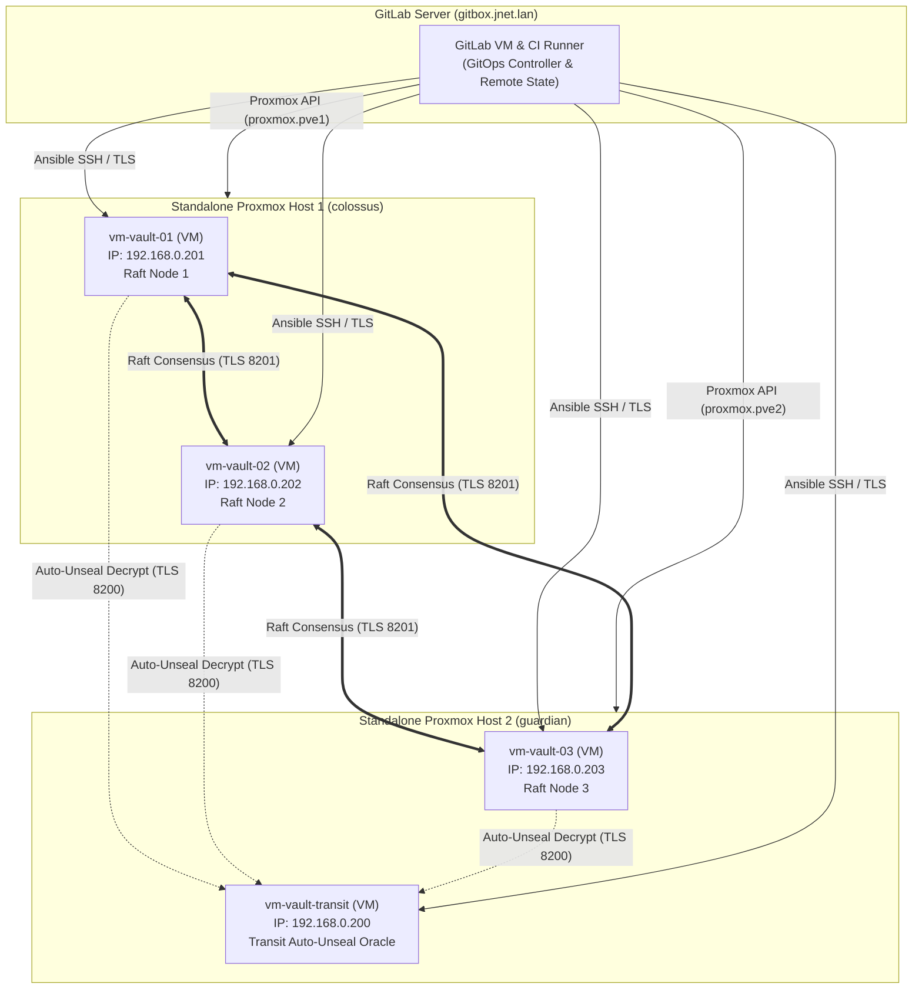

# Vault Bootstrap: 3-Node HA Cluster + Transit Auto-Unseal VM on Proxmox VE

This repo has everything needed to stand up a highly available 3-node HashiCorp Vault cluster (using Raft storage) plus a separate Transit Vault for auto-unsealing — all as code. It covers the infrastructure (Terraform / OpenTofu), the configuration (Ansible), and the GitOps CI/CD pipeline (`.gitlab-ci.yml`) that ties it all together, running across two standalone Proxmox VE hosts: **`colossus`** and **`guardian`**.

---

## 🏛️ System Architecture



---

## ⚖️ Hardware Distribution & Quorum Logic

A 3-node Raft cluster needs a strict majority — 2 out of 3 nodes — to keep working ($Q = \lfloor 3/2 \rfloor + 1 = 2$). Here's how those 3 nodes, plus the Transit VM, are split across the 2 physical hosts:

* **Host 1 (`colossus`)** runs `vm-vault-01` (`192.168.0.201`) and `vm-vault-02` (`192.168.0.202`), both cloned from the AlmaLinux 9 CIS Level 2 template (ID 1000). That's 2 of the 3 Raft votes.
* **Host 2 (`guardian`)** runs `vm-vault-03` (`192.168.0.203`) and `vm-vault-transit` (`192.168.0.200`), also cloned from Template 1000. That's the 3rd Raft vote, plus the Transit auto-unseal oracle.
* **Hypervisor independence**: `colossus` and `guardian` are standalone hosts with no clustering between them, so a problem on one can never drag the other down.

### Failure Scenarios & Mitigations

| Failure Scenario | Active Raft Nodes | Quorum State | Cluster Impact | Operational Action |
|---|---|---|---|---|
| **Host 2 (`guardian`) Fails** | 2 / 3 (`vm-vault-01`, `vm-vault-02`) | **QUORUM MAINTAINED** | No downtime — the cluster keeps reading and writing normally. Transit is only needed when a node restarts. | Restore `guardian`, or restart `vm-vault-transit`, whenever it's convenient. |
| **Host 1 (`colossus`) Fails** | 1 / 3 (`vm-vault-03`) | **QUORUM LOST** | The cluster stops accepting writes, to avoid the risk of split-brain corruption. | If `colossus` can be recovered, just power it back on. If it's gone for good, run [`scripts/raft_recovery.sh`](scripts/raft_recovery.sh) on `vm-vault-03` to force it into single-node quorum. |
| **Network Partition (colossus vs guardian)** | `colossus` (2 nodes) vs `guardian` (1 node) | `colossus` keeps quorum (2/3) | `colossus` keeps serving clients; `guardian` isolates itself rather than risk a split-brain write. | The partition heals itself once the network link is back; Raft catches the log up automatically. |
| **Transit VM Fails** | 3 / 3 | **QUORUM MAINTAINED** | No downtime — nodes that are already unsealed keep working fine. | Restart `vm-vault-transit` whenever convenient. |

---

## 📐 Architectural Rationale & Engineering Decisions

Here's the reasoning behind the bigger design decisions in this project, and why they were made this way.

### 1. Asymmetrical Raft Quorum Across Dual Hypervisors
* **The Challenge**: Most HA guides assume you have 3 or more physical hosts. In a real homelab, you're often stuck with 2.
* **The Solution**: Instead of clustering the hypervisors themselves — which brings its own split-brain risk (Corosync/pmxcfs) — `colossus` and `guardian` stay completely independent. The quorum logic happens one layer up, inside Vault's own Raft consensus ($N=3, Q=2$): Host 1 holds 2 of the 3 votes, and Host 2 holds the 3rd vote plus the Transit unseal VM. That means the cluster survives Host 2 going down with zero downtime, and there's no cross-hypervisor locking to worry about.

### 2. Zero-Touch Auto-Unseal Without Cloud KMS
* **The Challenge**: Open-source Vault normally needs a human to type in Shamir unseal keys by hand every time it restarts. That's a real problem for anything that reboots on its own, like a kernel upgrade or an automated node rebuild.
* **The Solution**: There's a separate, isolated Vault VM (`vm-vault-transit`) running just the Transit Secrets Engine. A small systemd service (`vault-transit-unseal.service`) unseals it automatically on boot in about a second, which in turn lets the main cluster auto-unseal too — no commercial cloud KMS or Vault Enterprise license required.

### 3. Sentinel-Based Idempotency & Zero-Drift Single Node Recovery
* **The Challenge**: Standing the cluster up from scratch (Day 1) is the easy part. Rebuilding a single node that died (Day 2) without breaking the healthy ones is where things usually go wrong — like accidentally regenerating the Root CA or re-issuing certificates on nodes that were already fine.
* **The Solution**:
  * **Marker files as a sentinel**: Each node gets a marker file at `/etc/vault.d/.vault_bootstrapped` once it's up and running. When rebuilding a single node (say, `vm-vault-03`), Ansible checks every other node for that marker to find a healthy survivor, copies its existing Root CA, issues a certificate for just the replacement node, and rejoins it to the Raft leader — without touching anything that already worked.
  * **Terraform lifecycle locks**: `lifecycle { ignore_changes = all }` is set on every VM resource, so Terraform never reboots or modifies a healthy running VM just because it's re-applying to fix one broken node.

### 4. Linux Kernel Memory Locking (`mlock`) & CIS Hardening
* **The Challenge**: If Vault's process memory ever gets swapped to disk, unencrypted master keys could end up sitting on the filesystem where someone with disk access could recover them.
* **The Solution**: Every VM starts from a minimal **AlmaLinux 9 CIS Level 2** template. The Vault binary is granted the `cap_ipc_lock=+ep` capability, systemd is locked with `LimitMEMLOCK=infinity`, and `disable_mlock` is always set to `false` — so Vault's memory is locked in RAM and never swapped. SELinux file contexts (`bin_t`, `var_lib_t`) and mutual TLS (mTLS on port 8201) are applied automatically as well.

### 5. Learning Vault Solo, With AI as a Sounding Board
* **The Challenge**: This was my first time building a HashiCorp Vault cluster, and I built it alone — no mentor or team to check my thinking against. Raft quorum, auto-unseal, and CIS hardening all have easy ways to get wrong, and there was no one nearby to catch a bad assumption before it became a bad decision.
* **The Solution**: I used Claude and Gemini to fill that gap — asking questions, talking through tradeoffs, and getting help writing Ansible tasks, Terraform config, and docs faster than I could alone. But every decision in this repo — the quorum layout, the auto-unseal design, the hardening choices — is one I made and then tested by hand, including the failure scenarios in [`docs/testing-and-validation.md`](docs/testing-and-validation.md). To me this isn't different from reading docs or asking questions in a forum — just faster and more back-and-forth.

---

## 📁 Repository Structure

```
vault-bootstrap/
├── .gitlab-ci.yml                  # End-to-end GitOps pipeline (Plan -> Apply -> Ansible -> Verify)
├── README.md                       # Operational guide
├── docs/
│   ├── architecture.md             # Architecture and threat model
│   ├── testing-and-validation.md   # Chaos testing & failover validation runbook
│   ├── security-operations.md      # Post-bootstrap secrets, recovery keys & break-glass runbook
│   ├── gitlab-setup.md             # GitLab CI/CD setup guide on gitbox.jnet.lan
│   ├── template-setup.md           # AlmaLinux 9 CIS Level 2 Proxmox template (ID 1000) setup guide
│   └── packer-repaving.md          # Automated Packer build & rolling repave guide
├── packer/                         # Automated AlmaLinux 9 CIS Level 2 Image Builder
│   ├── almalinux9-cis.pkr.hcl      # Proxmox ISO Packer template
│   ├── variables.pkr.hcl           # Packer variable definitions
│   ├── pkrvars.example.hcl         # Sample build variables
│   ├── http/ks.cfg                 # Automated CIS Kickstart configuration
│   └── scripts/                    # Hardening and image cleanup provisioners
├── terraform/                      # OpenTofu / Terraform Proxmox IaC
│   ├── versions.tf                 # bpg/proxmox provider & GitLab HTTP backend
│   ├── variables.tf                # Dual-host endpoints, node configs, credentials
│   ├── main.tf                     # Standalone provider configurations (proxmox.pve1, proxmox.pve2)
│   ├── vms.tf                      # 4x Vault VMs: 3x Raft Cluster + 1x Transit Auto-Unseal (Template 1000)
│   ├── outputs.tf                  # Outputs & dynamic Ansible inventory generation
│   └── terraform.tfvars.example    # Sample configuration values
├── ansible/                        # Configuration Management & Orchestration
│   ├── ansible.cfg                 # Performance, SSH, and role settings
│   ├── inventory/
│   │   ├── hosts.yaml              # Node inventory mapping (192.168.0.200 - 203)
│   │   ├── hosts.example.yaml      # Sample inventory template for external environments
│   │   └── group_vars/             # Host group variable scoping
│   │       ├── all.yaml            # Global PKI, domain, versions, sentinel marker
│   │       ├── vault_cluster.yaml  # Raft cluster variables & recovery keys
│   │       └── vault_transit.yaml  # Transit Auto-Unseal parameters
│   ├── roles/
│   │   ├── vault_common/           # Sentinel discovery, binary install, systemd, user, mlock
│   │   ├── vault_pki/              # Mutual TLS Root CA slurp & SAN certificate issuance
│   │   ├── vault_transit/          # Transit engine init, unseal key & scoped token
│   │   └── vault_cluster/          # Raft configuration, auto-unseal, retry_join, sentinel marker
│   └── playbooks/
│       ├── site.yaml               # Master end-to-end bootstrap playbook
│       ├── rolling_update.yaml     # Zero-downtime rolling repave (Method A)
│       ├── provision_transit.yaml  # Standalone Transit Vault playbook
│       └── provision_cluster.yaml  # Standalone Main Cluster playbook
└── scripts/
    ├── vault_env.sh                # CLI environment configuration helper
    └── raft_recovery.sh            # Disaster recovery single-node quorum recovery
```

---

## 🚀 Deployment Guide (GitOps Pipeline)

The main way to deploy this is through the GitLab CI/CD pipeline, which handles everything end-to-end.

For full setup instructions (Proxmox API tokens and runner setup), see **[docs/gitlab-setup.md](docs/gitlab-setup.md)**.

### 1. Configure GitLab CI/CD Variables
In your GitLab repository (**Settings** $\rightarrow$ **CI/CD** $\rightarrow$ **Variables**), configure the following:

| Variable | Masked | Description |
|---|---|---|
| `TF_VAR_pve_host_1_endpoint` | No | API URL for Host 1 (e.g. `https://colossus.jnet.lan:8006/`) |
| `TF_VAR_pve_host_1_api_token` | **Yes** | API token secret on `colossus` |
| `TF_VAR_pve_host_2_endpoint` | No | API URL for Host 2 (e.g. `https://guardian.jnet.lan:8006/`) |
| `TF_VAR_pve_host_2_api_token` | **Yes** | API token secret on `guardian` |
| `TF_VAR_ssh_public_keys` | No | Array with your public SSH key (`["ssh-ed25519 ..."]`) |
| `SSH_PRIVATE_KEY` | No | Private SSH key (ED25519) for Ansible node configuration |

### 2. Trigger the Pipeline
Push a commit to `main` (or click **Run pipeline** in GitLab). The pipeline runs through:
1. **`validate`**: Syntax & lint checks (`terraform validate`, `ansible-playbook --syntax-check`).
2. **`plan`**: Builds and inspects the Terraform execution plan with remote state locks.
3. **`apply`**: Provisions VMs on `colossus` and `guardian` and assigns them to `backup_pool`.
4. **`configure`**: Distributes mTLS certs, initializes Transit, auto-unseals, and joins Raft nodes.
5. **`verify`**: Runs automated cluster health checks against `/v1/sys/health`.

---

## 🛠️ Operational & Disaster Recovery Utilities

The `scripts/` directory has a couple of helpers for cluster maintenance:

* **[`scripts/vault_env.sh`](scripts/vault_env.sh)**: Sets up your local shell environment with `VAULT_ADDR`, `VAULT_CACERT`, and a token, for quick CLI access:
  ```bash
  source scripts/vault_env.sh 192.168.0.201
  vault status
  vault operator raft list-peers
  ```
* **[`scripts/raft_recovery.sh`](scripts/raft_recovery.sh)**: A disaster recovery script for the worst case — forces single-node quorum promotion on `vm-vault-03` if `colossus` is permanently destroyed.

---

## 🗺️ Roadmap & Future Projects

* **Packer Golden Image CI/CD Pipeline**: Automate the AlmaLinux 9 CIS Level 2 template build (ID 1000) itself, so `colossus` and `guardian` stay in sync automatically via a scheduled GitLab CI/CD job. *(Not built yet.)*
* **L4 Load Balancer Integration**: Put a Layer 4 load balancer (HAProxy / VIP at `https://vault.jnet.lan:8200`) in front of the 3-node cluster, so clients don't need to know which node is currently active.
* **OIDC & AppRole Provisioning**: Add Terraform-managed OIDC and AppRole setup for application secrets and human authentication.

---

## 📚 Documentation Index

* **[Architecture & Quorum Guide](docs/architecture.md)**: Physical host topology, Raft consensus mechanics, and failure domain analysis.
* **[Testing & Chaos Validation Runbook](docs/testing-and-validation.md)**: Step-by-step procedures for node loss, leader failover, auto-unseal recovery, and data replication validation.
* **[Post-Bootstrap Security & Operations Guide](docs/security-operations.md)**: Recovery keys, artifact security, root token revocation, workstation TLS CA setup, and break-glass procedures.
* **[GitLab CI/CD Setup Guide](docs/gitlab-setup.md)**: Runner installation, CI/CD variables, and pipeline configuration.
* **[Proxmox VM Template Guide](docs/template-setup.md)**: AlmaLinux 9 CIS Level 2 Golden Image creation.
* **[Zero-Downtime Repaving Guide](docs/packer-repaving.md)**: Rolling updates and immutable infrastructure repaving.
