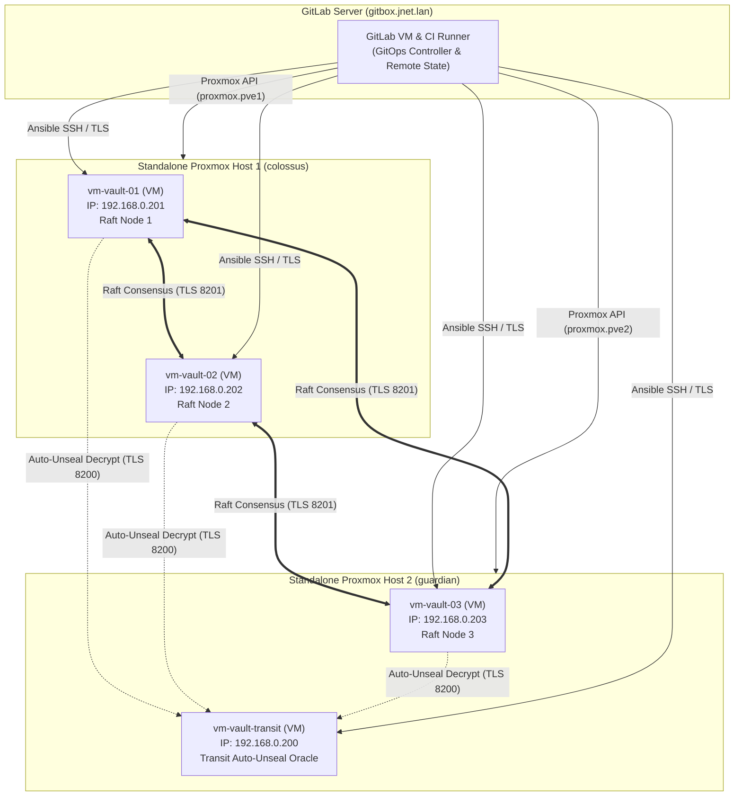

# Vault Bootstrap: 3-Node HA Cluster + Transit Auto-Unseal VM on Proxmox VE

This repository contains the complete Infrastructure-as-Code (Terraform / OpenTofu), Configuration Management (Ansible), and GitOps CI/CD pipeline (`.gitlab-ci.yml`) to deploy a production-grade, highly available **3-Node HashiCorp Vault Cluster** (Raft Integrated Storage) with an isolated **Transit Auto-Unseal Vault VM** across **2x Standalone Proxmox VE physical hosts: `colossus` and `guardian`**.

---

## 🏛️ System Architecture



---

## ⚖️ Hardware Distribution & Quorum Logic

In a 3-node Raft consensus cluster, quorum requires a strict majority of **2 nodes** ($Q = \lfloor 3/2 \rfloor + 1 = 2$). Across your 2 standalone physical hosts:

* **Host 1 (`colossus`)**: `vm-vault-01` (`192.168.0.201`), `vm-vault-02` (`192.168.0.202`) — Cloned from AlmaLinux 9 CIS Level 2 template (ID 1000). Holds 2 Raft voting members.
* **Host 2 (`guardian`)**: `vm-vault-03` (`192.168.0.203`) [Cloned from Template 1000], `vm-vault-transit` (`192.168.0.200`) [Cloned from Template 1000] — Holds 1 Raft voting member + Transit Auto-Unseal oracle.
* **Hypervisor Independence**: Because `colossus` and `guardian` are non-clustered standalone hosts, they have complete failure isolation with zero inter-hypervisor dependencies.

### Failure Scenarios & Mitigations

| Failure Scenario | Active Raft Nodes | Quorum State | Cluster Impact | Operational Action |
|---|---|---|---|---|
| **Host 2 (`guardian`) Fails** | 2 / 3 (`vm-vault-01`, `vm-vault-02`) | **QUORUM MAINTAINED** | **Zero downtime.** Cluster continues read/write operations seamlessly. Transit is only required when instances reboot/restart. | Restore `guardian` or restart `vm-vault-transit` VM when convenient. |
| **Host 1 (`colossus`) Fails** | 1 / 3 (`vm-vault-03`) | **QUORUM LOST** | **Cluster halts writes** to protect against split-brain corruption. | If `colossus` is recoverable, power it back on. If permanently destroyed, run [`scripts/raft_recovery.sh`](scripts/raft_recovery.sh) on `vm-vault-03` to promote it to single-node quorum. |
| **Network Partition (colossus vs guardian)** | `colossus` (2 nodes) vs `guardian` (1 node) | `colossus` retains quorum (2/3) | `colossus` continues serving client traffic; `guardian` isolates itself. | Network partition auto-heals when link recovers; Raft log syncs automatically. |
| **Transit VM Fails** | 3 / 3 | **QUORUM MAINTAINED** | **Zero downtime.** Existing unsealed memory state is unaffected. | Restart `vm-vault-transit` VM. |

---

## 📐 Architectural Rationale & Engineering Decisions

This project demonstrates how deep Linux systems administration principles are codified into modern Infrastructure-as-Code and declarative GitOps pipelines.

### 1. Asymmetrical Raft Quorum Across Dual Hypervisors
* **The Challenge**: Standard high-availability blueprints mandate $\ge 3$ physical hypervisors. In real-world edge environments and homelabs, physical hardware is often constrained to 2 nodes.
* **The Solution**: Rather than implementing complex hypervisor clustering (Corosync/pmxcfs) which introduces split-brain risks, `colossus` and `guardian` operate as **independent, standalone hypervisors**. Raft consensus ($N=3, Q=2$) is established purely at the application layer: Host 1 holds 2 voting members, Host 2 holds 1 voting member + the Transit unseal oracle. This guarantees zero downtime if Host 2 fails and eliminates cross-hypervisor locking.

### 2. Zero-Touch Auto-Unseal Without Cloud KMS
* **The Challenge**: Traditional open-source Vault requires human key custodians to enter Shamir unseal shards manually on every reboot, creating unacceptable downtime during kernel upgrades or automated node repaving.
* **The Solution**: We deploy an isolated Vault VM (`vm-vault-transit`) running the Transit Secrets Engine. A custom systemd unit (`vault-transit-unseal.service`) automatically unseals Transit on boot in 1 second, enabling hands-free auto-unsealing for the main Raft cluster without commercial cloud KMS or Vault Enterprise licenses.

### 3. Sentinel-Based Idempotency & Zero-Drift Single Node Recovery
* **The Challenge**: Greenfield deployments (Day 1) are straightforward, but rebuilding a single dead node (Day 2) frequently triggers pipeline failures—such as overwriting surviving Root CAs, regenerating certificates across healthy nodes, or cycling surviving peers.
* **The Solution**:
  * **Sentinel Marker Discovery**: Ansible checks for `/etc/vault.d/.vault_bootstrapped`. When rebuilding a single node (e.g., `vm-vault-03`), Ansible dynamically discovers surviving peers, slurps the existing Root CA, issues certificates *only* for the replacement node, and rejoins the Raft leader without disrupting active quorum.
  * **Terraform Lifecycle Locks**: Configured `lifecycle { ignore_changes = [clone] }` to ensure Proxmox never reboots or modifies healthy running VMs during partial Terraform applies.

### 4. Linux Kernel Memory Locking (`mlock`) & CIS Hardening
* **The Challenge**: In security-critical workloads, unencrypted process memory pages dumped to swap space can expose master encryption keys.
* **The Solution**: All VMs are cloned from a minimal **AlmaLinux 9 CIS Level 2** template. Vault binary is granted `cap_ipc_lock=+ep`, systemd is locked with `LimitMEMLOCK=infinity`, and `disable_mlock = false` is enforced. SELinux file contexts (`bin_t`, `var_lib_t`) and mutual TLS (mTLS on port 8201) are applied declaratively.

---

## 📁 Repository Structure

```
vault-bootstrap/
├── .gitlab-ci.yml                  # End-to-end GitOps pipeline (Plan -> Apply -> Ansible -> Verify)
├── README.md                       # Comprehensive operational guide
├── docs/
│   ├── architecture.md             # Deep-dive architecture and threat model
│   ├── security-operations.md      # Post-bootstrap secrets, recovery keys & break-glass runbook
│   ├── gitlab-setup.md             # GitLab CI/CD setup guide on gitbox.jnet.lan
│   ├── template-setup.md           # AlmaLinux 9 CIS Level 2 Proxmox template (ID 1000) setup guide
│   └── packer-repaving.md          # Automated Packer build & rolling repave guide
├── packer/                         # Automated AlmaLinux 9 CIS Level 2 Image Builder
│   ├── almalinux9-cis.pkr.hcl      # Proxmox ISO Packer template
│   ├── variables.pkr.hcl           # Packer variable definitions
│   ├── pkrvars.example.hcl         # Sample build variables
│   ├── http/ks.cfg                 # Automated CIS Kickstart configuration
│   └── scripts/                    # Hardening and image cleanup provisioners
├── terraform/                      # OpenTofu / Terraform Proxmox IaC
│   ├── versions.tf                 # bpg/proxmox provider & GitLab HTTP backend
│   ├── variables.tf                # Dual-host endpoints, node configs, credentials
│   ├── main.tf                     # Standalone provider configurations (proxmox.pve1, proxmox.pve2)
│   ├── vms.tf                      # 4x Vault VMs: 3x Raft Cluster + 1x Transit Auto-Unseal (Template 1000)
│   ├── outputs.tf                  # Outputs & dynamic Ansible inventory generation
│   └── terraform.tfvars.example    # Sample configuration values
├── ansible/                        # Configuration Management & Orchestration
│   ├── ansible.cfg                 # Performance, SSH, and role settings
│   ├── inventory/
│   │   ├── hosts.yaml              # Node inventory mapping (192.168.0.200 - 203)
│   │   ├── hosts.example.yaml      # Sample inventory template for external environments
│   │   └── group_vars/             # Host group variable scoping
│   │       ├── all.yaml            # Global PKI, domain, versions, sentinel marker
│   │       ├── vault_cluster.yaml  # Raft cluster variables & recovery keys
│   │       └── vault_transit.yaml  # Transit Auto-Unseal parameters
│   ├── roles/
│   │   ├── vault_common/           # Sentinel discovery, binary install, systemd, user, mlock
│   │   ├── vault_pki/              # Mutual TLS Root CA slurp & SAN certificate issuance
│   │   ├── vault_transit/          # Transit engine init, unseal key & scoped token
│   │   └── vault_cluster/          # Raft configuration, auto-unseal, retry_join, sentinel marker
│   └── playbooks/
│       ├── site.yaml               # Master end-to-end bootstrap playbook
│       ├── rolling_update.yaml     # Zero-downtime rolling repave (Method A)
│       ├── provision_transit.yaml  # Standalone Transit Vault playbook
│       └── provision_cluster.yaml  # Standalone Main Cluster playbook
└── scripts/
    ├── vault_env.sh                # CLI environment configuration helper
    └── raft_recovery.sh            # Disaster recovery single-node quorum recovery
```

---

## 🚀 Deployment Guide (GitOps Pipeline)

The primary and fully validated deployment method is automated end-to-end via the **GitLab CI/CD GitOps Pipeline**.

For complete setup instructions (Proxmox API tokens and runner setup), see **[docs/gitlab-setup.md](docs/gitlab-setup.md)**.

### 1. Configure GitLab CI/CD Variables
In your GitLab repository (**Settings** $\rightarrow$ **CI/CD** $\rightarrow$ **Variables**), configure the following:

| Variable | Masked | Description |
|---|---|---|
| `TF_VAR_pve_host_1_endpoint` | No | API URL for Host 1 (e.g. `https://colossus.jnet.lan:8006/`) |
| `TF_VAR_pve_host_1_api_token` | **Yes** | API token secret on `colossus` |
| `TF_VAR_pve_host_2_endpoint` | No | API URL for Host 2 (e.g. `https://guardian.jnet.lan:8006/`) |
| `TF_VAR_pve_host_2_api_token` | **Yes** | API token secret on `guardian` |
| `TF_VAR_ssh_public_keys` | No | Array with your public SSH key (`["ssh-ed25519 ..."]`) |
| `SSH_PRIVATE_KEY` | No | Private SSH key (ED25519) for Ansible node configuration |

### 2. Trigger the Pipeline
Push a commit to `main` (or click **Run pipeline** in GitLab). The pipeline automatically executes:
1. **`validate`**: Syntax & lint verification (`terraform validate`, `ansible-playbook --syntax-check`).
2. **`plan`**: Generates and inspects the Terraform execution plan with remote state locks.
3. **`apply`**: Provisions VMs on `colossus` and `guardian` and assigns them to `backup_pool`.
4. **`configure`**: Distributes mTLS certs, initialises Transit, auto-unseals, and joins Raft nodes.
5. **`verify`**: Runs automated cluster health checks against `/v1/sys/health`.

---

## 🛠️ Operational & Disaster Recovery Utilities

The `scripts/` directory provides helper utilities for cluster maintenance:

* **[`scripts/vault_env.sh`](scripts/vault_env.sh)**: Sets up your local shell environment with `VAULT_ADDR`, `VAULT_CACERT`, and token for CLI management:
  ```bash
  source scripts/vault_env.sh 192.168.0.201
  vault status
  vault operator raft list-peers
  ```
* **[`scripts/raft_recovery.sh`](scripts/raft_recovery.sh)**: Disaster recovery script for catastrophic failure scenarios (forces single-node quorum promotion on `vm-vault-03` if `colossus` is permanently destroyed).

---

## 🗺️ Roadmap & Future Projects

* **Packer Golden Image CI/CD Pipeline**: Fully automating the creation and synchronization of the AlmaLinux 9 CIS Level 2 base template (ID 1000) across `colossus` and `guardian` via scheduled GitLab CI/CD jobs. *(Planned for future implementation)*
* **L4 Load Balancer Integration**: Fronting the 3-node cluster with a dedicated Layer 4 HAProxy / VIP (`https://vault.jnet.lan:8200`) for seamless client failover.
* **OIDC & AppRole Provisioning**: Automated Terraform provider integration for application secrets and human authentication.

---

## 📚 Documentation Index

* **[Architecture & Quorum Guide](docs/architecture.md)**: Physical host topology, Raft consensus mechanics, and failure domain analysis.
* **[Testing & Chaos Validation Runbook](docs/testing-and-validation.md)**: Step-by-step procedures for node loss, leader failover, auto-unseal recovery, and data replication validation.
* **[Post-Bootstrap Security & Operations Guide](docs/security-operations.md)**: Recovery keys, artifact security, root token revocation, workstation TLS CA setup, and break-glass procedures.
* **[GitLab CI/CD Setup Guide](docs/gitlab-setup.md)**: Runner installation, CI/CD variables, and pipeline configuration.
* **[Proxmox VM Template Guide](docs/template-setup.md)**: AlmaLinux 9 CIS Level 2 Golden Image creation.
* **[Zero-Downtime Repaving Guide](docs/packer-repaving.md)**: Rolling updates and immutable infrastructure repaving.
