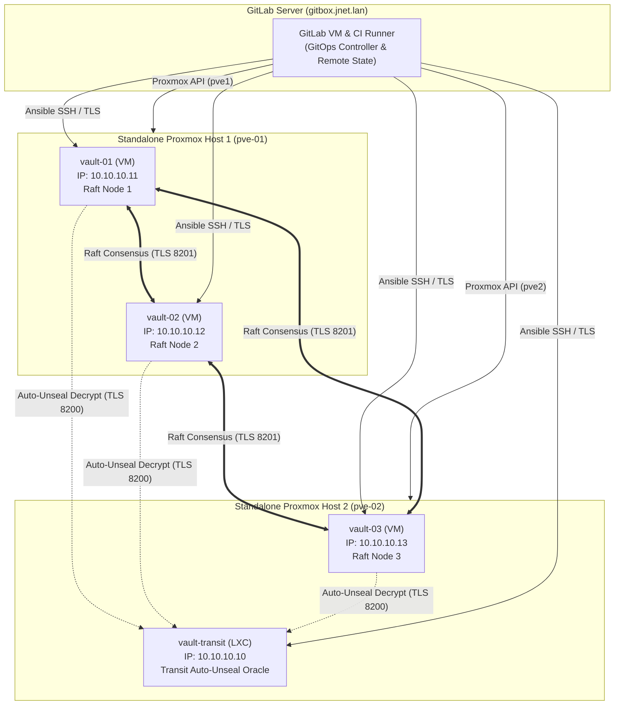

# Vault Bootstrap: 3-Node HA Cluster + Transit Auto-Unseal LXC on Proxmox VE

This repository contains the complete Infrastructure-as-Code (Terraform / OpenTofu), Configuration Management (Ansible), and GitOps CI/CD pipeline (`.gitlab-ci.yml`) to deploy a production-grade, highly available **3-Node HashiCorp Vault Cluster** (Raft Integrated Storage) with an isolated **Transit Auto-Unseal Vault LXC** across **2x Standalone Proxmox VE physical hosts**.

---

## 🏛️ System Architecture



---

## ⚖️ Hardware Distribution & Quorum Logic

In a 3-node Raft consensus cluster, quorum requires a strict majority of **2 nodes** ($Q = \lfloor 3/2 \rfloor + 1 = 2$). Across 2 standalone physical hosts:

* **Host 1 (`pve-01`)**: `vault-01` (VM), `vault-02` (VM) — Holds 2 Raft voting members.
* **Host 2 (`pve-02`)**: `vault-03` (VM), `vault-transit` (LXC) — Holds 1 Raft voting member + Transit Auto-Unseal oracle.
* **Hypervisor Independence**: Because `pve-01` and `pve-02` are non-clustered standalone hosts, they have complete failure isolation with zero inter-hypervisor dependencies.

### Failure Scenarios & Mitigations

| Failure Scenario | Active Raft Nodes | Quorum State | Cluster Impact | Operational Action |
|---|---|---|---|---|
| **Host 2 (`pve-02`) Fails** | 2 / 3 (`vault-01`, `vault-02`) | **QUORUM MAINTAINED** | **Zero downtime.** Cluster continues read/write operations seamlessly. Transit is only required when instances reboot/restart. | Restore Host 2 or restart `vault-transit` LXC when convenient. |
| **Host 1 (`pve-01`) Fails** | 1 / 3 (`vault-03`) | **QUORUM LOST** | **Cluster halts writes** to protect against split-brain corruption. | If Host 1 is recoverable, power it back on. If permanently destroyed, run [`scripts/raft_recovery.sh`](file:///home/ajensen/Repos/vault-bootstrap/scripts/raft_recovery.sh) on `vault-03` to promote it to single-node quorum. |
| **Network Partition (Host 1 vs Host 2)** | Host 1 (2 nodes) vs Host 2 (1 node) | Host 1 retains quorum (2/3) | Host 1 continues serving client traffic; Host 2 isolates itself. | Network partition auto-heals when link recovers; Raft log syncs automatically. |
| **Transit LXC Fails** | 3 / 3 | **QUORUM MAINTAINED** | **Zero downtime.** Existing unsealed memory state is unaffected. | Restart `vault-transit` LXC. |

---

## 📁 Repository Structure

```
vault-bootstrap/
├── .gitlab-ci.yml                  # End-to-end GitOps pipeline (Plan -> Apply -> Ansible -> Verify)
├── README.md                       # Comprehensive operational guide
├── docs/
│   ├── architecture.md             # Deep-dive architecture and threat model
│   └── gitlab-setup.md             # GitLab CI/CD setup guide on gitbox.jnet.lan
├── terraform/                      # OpenTofu / Terraform Proxmox IaC
│   ├── versions.tf                 # bpg/proxmox provider & GitLab HTTP backend
│   ├── variables.tf                # Dual-host endpoints, node configs, credentials
│   ├── main.tf                     # Standalone provider configurations (proxmox.pve1, proxmox.pve2)
│   ├── vms.tf                      # 3x Main Vault Raft VMs (Cloud-Init)
│   ├── lxc.tf                      # 1x Transit Auto-Unseal LXC
│   ├── outputs.tf                  # Outputs & dynamic Ansible inventory generation
│   └── terraform.tfvars.example    # Sample configuration values
├── ansible/                        # Configuration Management & Orchestration
│   ├── ansible.cfg                 # Performance, SSH, and role settings
│   ├── inventory/
│   │   └── hosts.yaml              # Node inventory mapping
│   ├── group_vars/
│   │   ├── all.yaml                # Global PKI & Vault versions
│   │   ├── vault_cluster.yaml      # Raft cluster variables & recovery keys
│   │   └── vault_transit.yaml      # Transit LXC parameters
│   ├── roles/
│   │   ├── vault_common/           # Binary install, systemd, user, mlock/capabilities
│   │   ├── vault_pki/              # Mutual TLS Root CA & SAN certificates
│   │   ├── vault_transit/          # Transit engine init, unseal key & scoped token
│   │   └── vault_cluster/          # Raft configuration, auto-unseal & auto-join
│   └── playbooks/
│       ├── site.yaml               # Master end-to-end bootstrap playbook
│       ├── provision_transit.yaml  # Standalone Transit Vault playbook
│       └── provision_cluster.yaml  # Standalone Main Cluster playbook
└── scripts/
    ├── vault_env.sh                # CLI environment configuration helper
    └── raft_recovery.sh            # Disaster recovery single-node quorum recovery
```

---

## 🚀 Deployment Guide

For full instructions on configuring `gitbox.jnet.lan` and Proxmox API tokens, see [docs/gitlab-setup.md](file:///home/ajensen/Repos/vault-bootstrap/docs/gitlab-setup.md).

### 1. GitLab CI / GitOps Automated Pipeline (Recommended)

1. **Configure CI/CD Variables** in your GitLab project (`Settings` > `CI/CD` > `Variables`):
   * `TF_VAR_pve_host_1_endpoint`: API URL of Host 1 (e.g. `https://10.10.10.2:8006/`).
   * `TF_VAR_pve_host_1_api_token`: API Token on Host 1 (`terraform-ci@pve!gitlab-runner=...`).
   * `TF_VAR_pve_host_2_endpoint`: API URL of Host 2 (e.g. `https://10.10.10.3:8006/`).
   * `TF_VAR_pve_host_2_api_token`: API Token on Host 2 (`terraform-ci@pve!gitlab-runner=...`).
   * `TF_VAR_ssh_public_keys`: Array containing your public SSH key.
   * `SSH_PRIVATE_KEY`: ED25519 private key for Ansible access.
2. **Push to `main`**:
   * Pipeline automatically triggers `terraform:apply`, runs `ansible:configure`, and validates health.

### 2. Manual / Local Execution

```bash
cd terraform
cp terraform.tfvars.example terraform.tfvars
# Fill in your Proxmox endpoints, tokens, and SSH keys in terraform.tfvars

terraform init
terraform apply

cd ../ansible
ansible-playbook -i inventory/hosts.yaml playbooks/site.yaml
```
