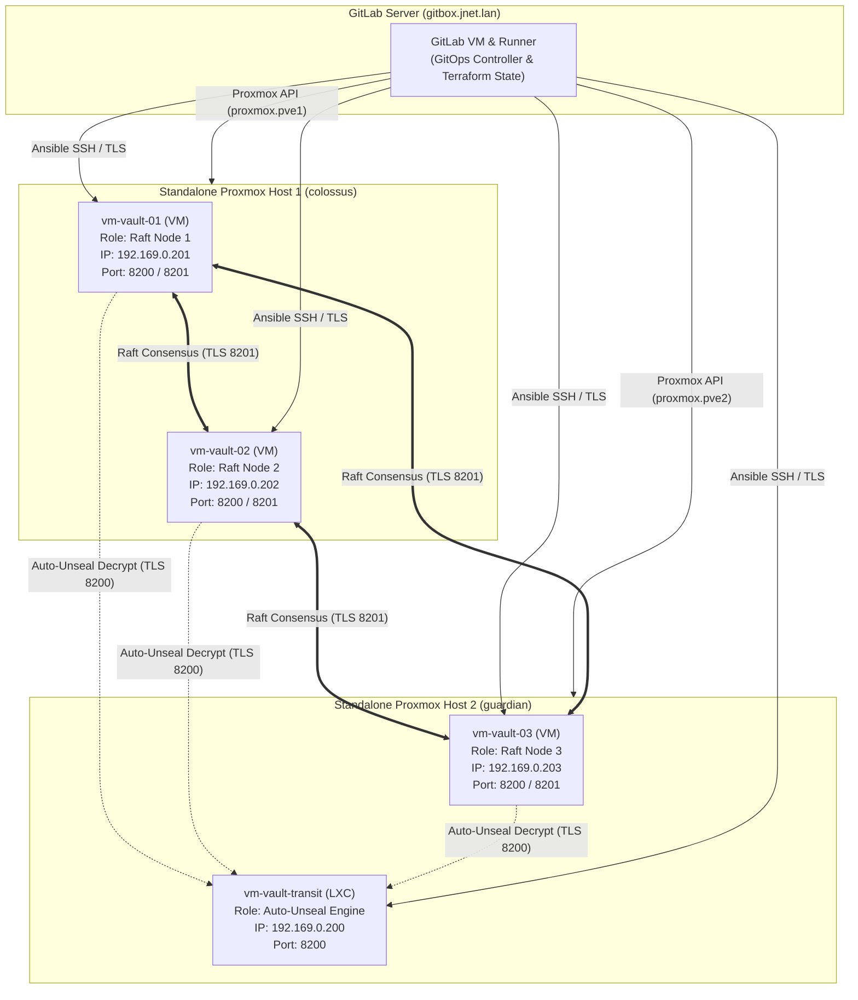
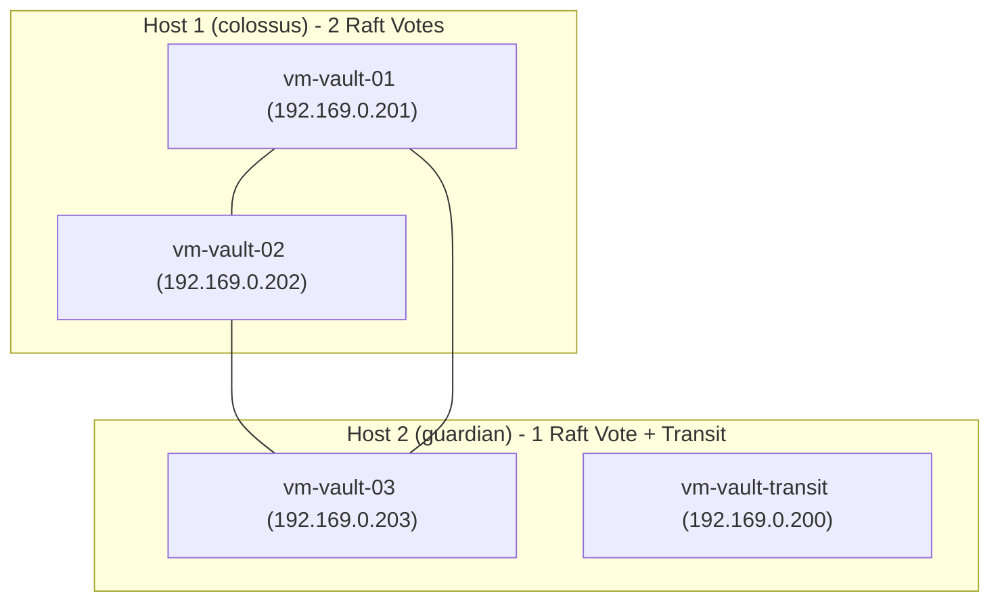
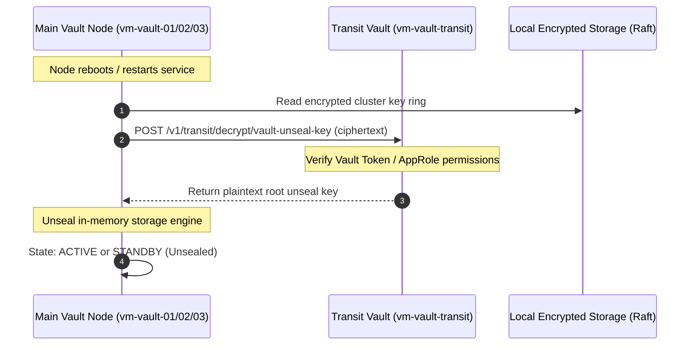

# Vault High Availability Architecture & Proxmox Distribution Guide

This document outlines the architecture, distribution logic, quorum behavior, network topology, and security hardening for a high-availability **3-Node HashiCorp Vault Cluster** with an isolated **Transit Auto-Unseal Vault LXC** running across **2x Standalone Proxmox VE physical hosts: `colossus` and `guardian`**.

---

## 1. Executive Architecture Overview

---

## 2. Standalone Hypervisors & Vault Quorum Analysis

### 2.1 Hypervisor Fault Isolation

Because `colossus` and `guardian` are **independent standalone hypervisors**:
* They do not share a cluster filesystem (`pmxcfs`) or Corosync ring.
* Hypervisor-level split-brain is completely eliminated: an issue on `colossus` will never cause `guardian` to enter a read-only lock or fencing state.
* Terraform targets each host independently via provider aliases (`proxmox.pve1` for `colossus` and `proxmox.pve2` for `guardian`).

### 2.2 Application-Level Raft Quorum

In HashiCorp Vault's Raft consensus algorithm:
$$Q = \left\lfloor \frac{N}{2} \right\rfloor + 1$$
For a 3-node cluster ($N=3$), minimum quorum requires **2 active nodes**.

* **Host 1 (`colossus`)**: `vm-vault-01` (VM), `vm-vault-02` (VM) — Holds 2 voting members.
* **Host 2 (`guardian`)**: `vm-vault-03` (VM), `vm-vault-transit` (LXC) — Holds 1 voting member + Transit Auto-Unseal oracle.

### 2.3 Failure Domain & Recovery Matrix

| Failure Event | Available Raft Nodes | Raft Quorum Status | Transit Status | Cluster Impact & Recovery Action |
|---|---|---|---|---|
| **Host 2 (`guardian`) Dies** | 2 / 3 (`vm-vault-01`, `vm-vault-02`) | **MAINTAINED** (2 $\ge$ 2) | Offline | **Zero disruption on active cluster operations.** Cluster remains fully read/write on `colossus`. Transit is only queried during node restarts. |
| **Host 1 (`colossus`) Dies** | 1 / 3 (`vm-vault-03`) | **LOST** (1 < 2) | Online | **Cluster enters safe read-only/halt state** to prevent split-brain. If `colossus` is unrecoverable, run [`scripts/raft_recovery.sh`](file:///home/ajensen/Repos/vault-bootstrap/scripts/raft_recovery.sh) on `vm-vault-03` to force single-node quorum. |
| **Inter-Host Network Split** | Host 1 (2 nodes) vs Host 2 (1 node) | Host 1 retains quorum (2/3); Host 2 is isolated (1/3) | Host 1 cannot reach Transit; Host 2 has Transit | Host 1 continues serving clients. Host 2 steps down. Split-brain is prevented because Raft leader election strictly requires $\ge 2$ votes. |
| **Transit LXC Fails** | 3 / 3 | **MAINTAINED** | Offline | **Zero runtime read/write disruption.** Existing in-memory barrier keys are unaffected. Restart `vm-vault-transit` LXC when convenient. |

---

## 3. Transit Auto-Unseal Architecture

Instead of manual shamir unseal keys entered by human key custodians after every reboot, HashiCorp Vault supports automated unsealing via the **Transit Secrets Engine**.

---

## 4. Network and Port Allocation

| Component | Hostname | IP Address | Listening Ports | Target Physical Host |
|---|---|---|---|---|
| **Vault Node 1** | `vm-vault-01` | `192.169.0.201` | `8200/tcp` (API), `8201/tcp` (Cluster) | `colossus` (Standalone) |
| **Vault Node 2** | `vm-vault-02` | `192.169.0.202` | `8200/tcp` (API), `8201/tcp` (Cluster) | `colossus` (Standalone) |
| **Vault Node 3** | `vm-vault-03` | `192.169.0.203` | `8200/tcp` (API), `8201/tcp` (Cluster) | `guardian` (Standalone) |
| **Transit Vault** | `vm-vault-transit` | `192.169.0.200` | `8200/tcp` (API) | `guardian` (Standalone) |
