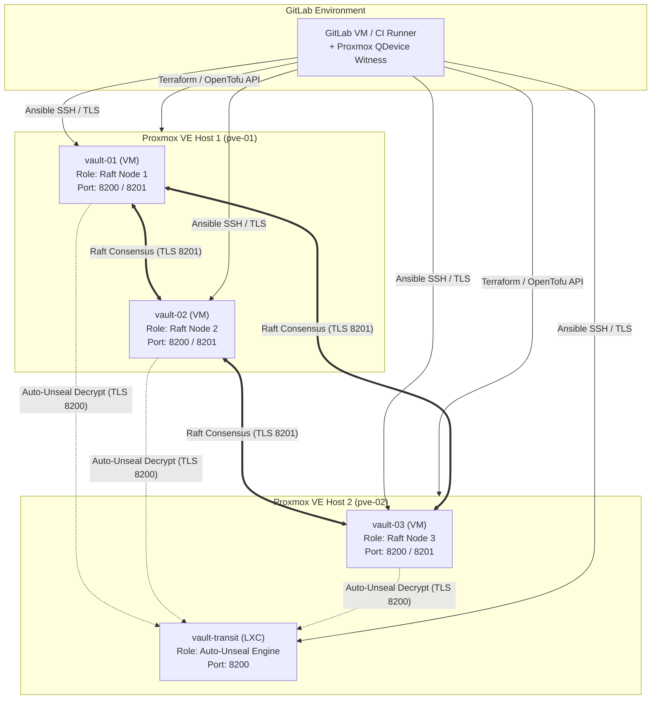
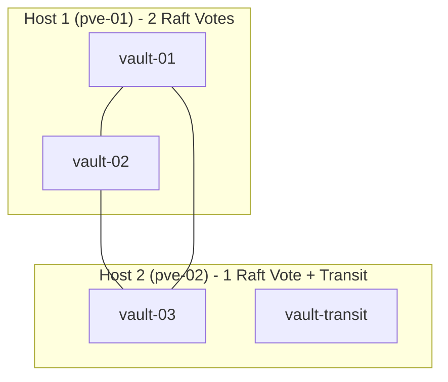
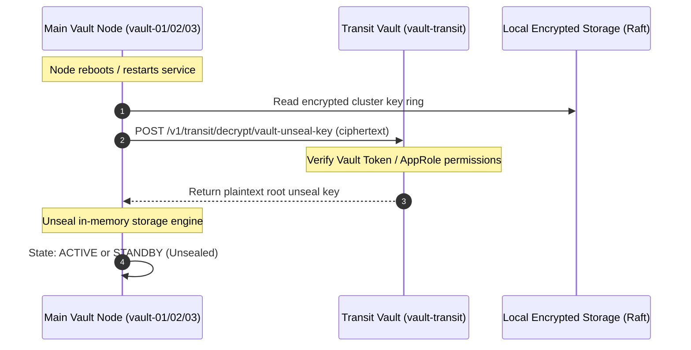

# Vault High Availability Architecture & Proxmox Distribution Guide

This document outlines the architecture, distribution logic, quorum behavior, network topology, and security hardening for a high-availability **3-Node HashiCorp Vault Cluster** with an isolated **Transit Auto-Unseal Vault LXC** running on **2x Proxmox VE physical hosts**.

---

## 1. Executive Architecture Overview



---

## 2. Hardware Distribution & Quorum Analysis

### 2.1 The 2-Host Physical Quorum Challenge

In distributed consensus algorithms (HashiCorp Raft), quorum is defined as:
$$Q = \left\lfloor \frac{N}{2} \right\rfloor + 1$$
For a 3-node cluster ($N=3$), minimum quorum requires **2 active nodes**.

When deploying across only **2 physical Proxmox hosts**, a 3-node cluster cannot be divided symmetrically. The instance layout is:
* **Host 1 (`pve-01`)**: `vault-01` (VM), `vault-02` (VM)
* **Host 2 (`pve-02`)**: `vault-03` (VM), `vault-transit` (LXC)
* **Witness / Tie-Breaker**: Proxmox Corosync QDevice configured on the GitLab VM to ensure the Proxmox cluster itself avoids split-brain.



### 2.2 Failure Domain & Recovery Matrix

| Failure Event | Available Raft Nodes | Raft Quorum Status | Transit Status | Cluster Impact & Recovery Action |
|---|---|---|---|---|
| **Host 2 (`pve-02`) Dies** | 2 / 3 (`vault-01`, `vault-02`) | **MAINTAINED** (2 $\ge$ 2) | Offline | **No impact on active cluster operations.** Cluster remains fully read/write. Transit is only called during node restart/unseal. If a node restarts while Host 2 is down, it waits for Transit restoration or manual unseal. |
| **Host 1 (`pve-01`) Dies** | 1 / 3 (`vault-03`) | **LOST** (1 < 2) | Online | **Cluster enters read-only/sealed safety state.** Prevents split-brain data corruption. If Host 1 is permanently lost, operator initiates Raft recovery (`peers.json`) on `vault-03`. If Proxmox HA replication is enabled, `vault-01`/`vault-02` automatically restart on Host 2. |
| **Inter-Host Network Split** | Host 1 (2 nodes) vs Host 2 (1 node) | Host 1 retains quorum (2/3); Host 2 is isolated (1/3) | Host 1 cannot reach Transit; Host 2 has Transit | Host 1 continues serving clients. Host 2 steps down. Split-brain is prevented because Raft leader election strictly requires $\ge 2$ votes. |
| **Transit LXC Fails** | 3 / 3 | **MAINTAINED** | Offline | **Zero runtime read/write disruption.** In-flight encryption/decryption and secret reads in the main cluster are completely independent of Transit. Only node restarts require Transit. |

### 2.3 Why Transit is Placed on Host 2
1. **Failure Decoupling**: Host 1 contains the Raft majority (2 nodes). Placing the Transit LXC on Host 2 avoids single-point-of-failure concentration on Host 1.
2. **Resource Efficiency**: An LXC container consumes negligible memory (~256MB–512MB RAM) and minimal CPU overhead, making it ideal for Host 2 alongside `vault-03`.
3. **Independent Lifecycle**: Transit Vault does not participate in the Main Vault's Raft consensus ring. It operates as an independent, single-node cryptographic oracle.

---

## 3. Transit Auto-Unseal Architecture

Instead of manual shamir unseal keys entered by human key custodians after every reboot, HashiCorp Vault supports automated unsealing via the **Transit Secrets Engine**.



### 3.1 Transit Security Policy
The Main Cluster authenticates to Transit Vault using a scoped Token or AppRole with minimal privileges:
```hcl
path "transit/encrypt/vault-unseal-key" {
  capabilities = ["update"]
}

path "transit/decrypt/vault-unseal-key" {
  capabilities = ["update"]
}
```

---

## 4. Network and Port Allocation

| Component | Hostname | IP Address (Example) | Listening Ports | Purpose |
|---|---|---|---|---|
| **Vault Node 1** | `vault-01` | `10.10.10.11` | `8200/tcp` (API), `8201/tcp` (Cluster) | Main Vault Active/Standby Node |
| **Vault Node 2** | `vault-02` | `10.10.10.12` | `8200/tcp` (API), `8201/tcp` (Cluster) | Main Vault Active/Standby Node |
| **Vault Node 3** | `vault-03` | `10.10.10.13` | `8200/tcp` (API), `8201/tcp` (Cluster) | Main Vault Active/Standby Node |
| **Transit Vault** | `vault-transit` | `10.10.10.10` | `8200/tcp` (API) | Dedicated Auto-Unseal Oracle |
| **Proxmox Host 1** | `pve-01` | `10.10.10.2` | `8006/tcp` (PVE API), `22/tcp` | Hypervisor Node 1 |
| **Proxmox Host 2** | `pve-02` | `10.10.10.3` | `8006/tcp` (PVE API), `22/tcp` | Hypervisor Node 2 |

---

## 5. Security Hardening Specifications

1. **Memory Locking (`mlock` / `cap_ipc_lock`)**: Prevent sensitive cryptographic material from paging to swap disk.
2. **Mutual TLS / Dedicated CA**:
   - Cluster internal communication on port 8201 requires mutual TLS.
   - API endpoints on port 8200 are TLS 1.3 enforced.
   - Subject Alternative Names (SANs) include DNS names, loopback, and individual node IPs.
3. **Dedicated System User & Sandboxing**:
   - Vault runs under unprivileged `vault:vault` (UID/GID 999).
   - Systemd unit restricts `/home`, `/root`, and mount namespaces (`ProtectSystem=full`, `PrivateTmp=yes`, `NoNewPrivileges=yes`).
4. **Separation of Concerns**:
   - Transit Vault root token is strictly used once to mint the scoped unseal token, then stored offline or revoked.
