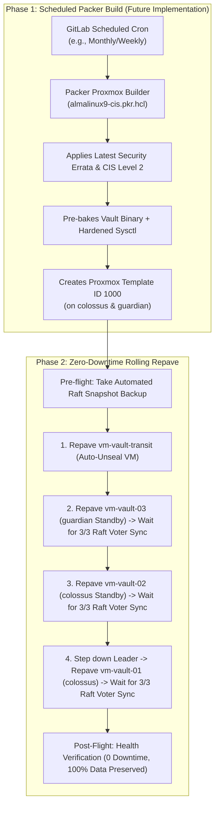

# Automated Repaving Guide (Packer + Method A Rolling Sync)

> [!NOTE]
> **Future Project Roadmap**: Automated Packer CI/CD template generation is a planned future project. Currently, the base golden image (Template ID 1000) is created and maintained on Proxmox using the [Template Setup Guide](template-setup.md). This document outlines the architectural blueprint and operational procedures once the automated Packer pipeline is integrated.

This guide documents the architecture, automation, and operational procedures for rebuilding the 3-Node HashiCorp Vault Cluster and Transit VM using **Packer** and **Method A (Zero-Downtime Rolling Raft Peer Sync)**.

---

## 1. Immutable Infrastructure Architecture



---

## 2. Why Method A (Rolling Raft Peer Sync)?

* **True Immutability**: Each node is completely rebuilt from the latest Packer golden image. No state or leftover configuration is preserved on the OS drive.
* **Automatic Synchronization**: Vault's Raft consensus automatically replicates the encrypted database log index and snapshot from the active leader to the newly booted node upon joining.
* **Quorum Preservation**: Because nodes are rebuilt **one at a time (`serial: 1`)**, 2 out of 3 voting members remain online continuously, satisfying the majority quorum requirement ($2 \ge 2$) throughout the entire rebuild cycle.

---

## 3. Packer Configuration

* **Template Definition**: `packer/almalinux9-cis.pkr.hcl`
* **Variables**: `packer/variables.pkr.hcl` and `packer/pkrvars.example.hcl`
* **Kickstart Automation**: `packer/http/ks.cfg` (Automated CIS partitioning, LVM layout, non-root user setup)
* **Provisioners**:
  * `packer/scripts/cis-hardening.sh`: Kernel sysctl tuning, `cap_ipc_lock=+ep`, SELinux file contexts (`bin_t`, `var_lib_t`).
  * `packer/scripts/cleanup.sh`: Wipes `/etc/machine-id`, cloud-init cache, logs, and temporary SSH keys.

### Running Packer Locally:
```bash
cd packer
packer init almalinux9-cis.pkr.hcl
packer build -var-file=pkrvars.hcl almalinux9-cis.pkr.hcl
```

---

## 4. Rolling Repave Execution

To execute a rolling zero-downtime repave across the cluster:

```bash
cd ansible
ansible-playbook -i inventory/hosts.yaml playbooks/rolling_update.yaml
```

### Safety Features Built-In:
1. **Pre-flight Snapshot**: Automatically saves a timestamped snapshot to `credentials/backups/raft-pre-repave-<timestamp>.snap`.
2. **Graceful Leader Step-Down**: If the node being cycled is the current active leader, Ansible calls `vault operator step-down` to transfer leadership before restarting.
3. **Quorum Gate**: Ansible polls `vault operator raft list-peers` and **will not proceed** to the next node until the newly repaved node has unsealed and rejoined the Raft consensus ring.
