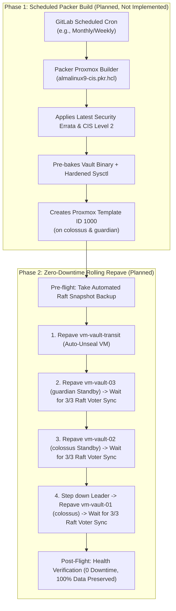

# Repaving Guide (Planned Packer Builds + Method A Rolling Sync)

> [!IMPORTANT]
> **Packer is not implemented yet.** Automated image builds with Packer are a planned future project. Nothing in the GitLab pipeline runs Packer today, and the files in `packer/` are untested drafts that have not been used to build a template.
>
> Right now, the base golden image (Template ID 1000) is built and maintained by hand on Proxmox using the [Template Setup Guide](template-setup.md). The only part of this guide that exists today is the rolling update playbook described in [Section 4](#4-rolling-update-execution-available-today), and it updates nodes in place rather than rebuilding them from a new image.

This guide lays out the planned architecture and procedures for rebuilding the 3-Node HashiCorp Vault Cluster and Transit VM using **Packer** and **Method A (Zero-Downtime Rolling Raft Peer Sync)**.

---

## 1. Planned Immutable Infrastructure Architecture



---

## 2. Why Method A (Rolling Raft Peer Sync)?

These are the design goals for the full repave workflow once Packer builds are in place:

* **True Immutability**: Each node would be completely rebuilt from the latest Packer golden image, with no state or leftover configuration kept on the OS drive.
* **Automatic Synchronization**: Vault's Raft consensus automatically replicates the encrypted database log index and snapshot from the active leader to the newly booted node when it joins.
* **Quorum Preservation**: Because nodes are rebuilt **one at a time (`serial: 1`)**, 2 out of 3 voting members stay online the whole time, satisfying the majority quorum requirement ($2 \ge 2$) throughout the rebuild cycle.

---

## 3. Packer Configuration (Draft, Not Implemented)

The `packer/` directory holds early draft files for the planned image build. They have not been run or validated, may be incomplete, and are not referenced by `.gitlab-ci.yml`. Do not rely on them to build Template 1000; use the [Template Setup Guide](template-setup.md) instead.

* **Template Definition**: `packer/almalinux9-cis.pkr.hcl`
* **Variables**: `packer/variables.pkr.hcl` and `packer/pkrvars.example.hcl`
* **Kickstart Automation**: `packer/http/ks.cfg` (Intended for CIS partitioning, LVM layout, non-root user setup)
* **Provisioners**:
  * `packer/scripts/cis-hardening.sh`: Kernel sysctl tuning, `cap_ipc_lock=+ep`, SELinux file contexts (`bin_t`, `var_lib_t`).
  * `packer/scripts/cleanup.sh`: Wipes `/etc/machine-id`, cloud-init cache, logs, and temporary SSH keys.

### Intended Local Build Workflow (Not Yet Tested):
```bash
cd packer
packer init almalinux9-cis.pkr.hcl
packer build -var-file=pkrvars.hcl almalinux9-cis.pkr.hcl
```

---

## 4. Rolling Update Execution (Available Today)

The `rolling_update.yaml` playbook exists and can be run now. It does **not** rebuild VMs from a new template. Instead, it re-applies the `vault_common`, `vault_pki`, and `vault_cluster` roles to each node in `vault_cluster` in place and restarts Vault, one node at a time. It does not touch `vm-vault-transit`.

```bash
cd ansible
ansible-playbook -i inventory/hosts.yaml playbooks/rolling_update.yaml
```

### Safety Features Built-In:
1. **Pre-flight Snapshot**: Automatically saves a timestamped snapshot to `credentials/backups/raft-pre-repave-<timestamp>.snap`.
2. **Graceful Leader Step-Down**: If the node being cycled is the current active leader, Ansible calls `vault operator step-down` to transfer leadership before restarting.
3. **Quorum Gate**: Ansible polls `vault operator raft list-peers` and **will not proceed** to the next node until the restarted node has unsealed and rejoined the Raft consensus ring.
