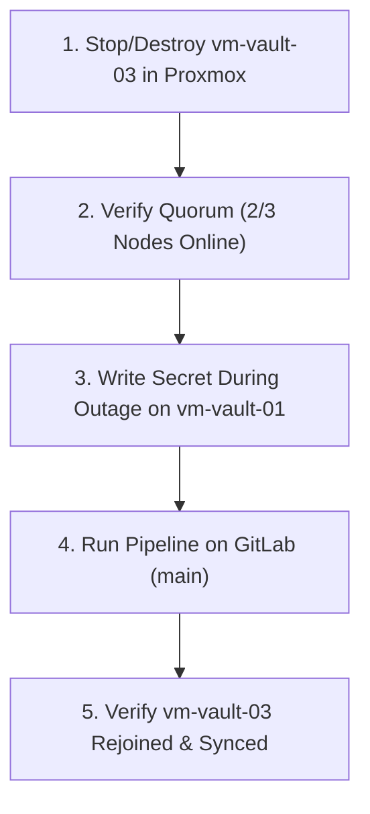
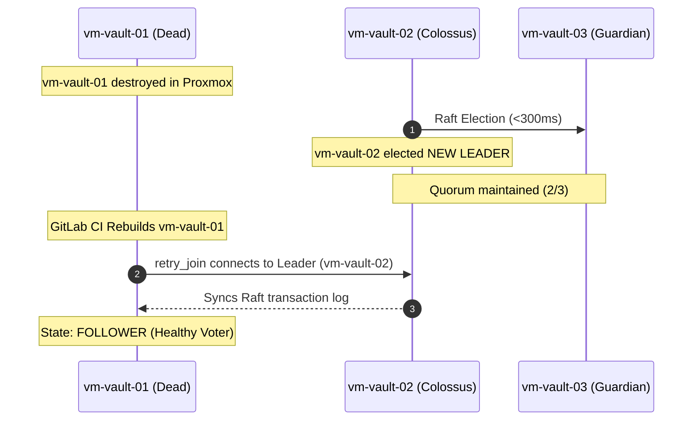

# Vault Cluster Chaos Engineering & Testing Runbook

This guide documents the step-by-step procedures for validating cluster quorum, high availability failovers, auto-unseal mechanisms, and automated GitOps single-node recovery across the 3-node HashiCorp Vault Raft cluster.

---

## 📋 Overview of Test Scenarios

| Scenario | Component Tested | Target Node | Expected Outcome |
|---|---|---|---|
| **[Scenario 1](#scenario-1-transit-auto-unseal-on-reboot)** | Transit Auto-Unseal | Any node | Service restarts and unseals in < 1 second without human keys. |
| **[Scenario 2](#scenario-2-follower-node-destruction--recovery)** | Raft Quorum & Node Recovery | `vm-vault-03` (or `02`) | Quorum maintained (2/3); data written during outage replicates upon pipeline recovery. |
| **[Scenario 3](#scenario-3-primary-leader-destruction--recovery)** | Leader Failover & Primary Rebuild | `vm-vault-01` | Instant leader election (<300ms); `vm-vault-01` rebuilt and synced from surviving peers. |
| **[Scenario 4](#scenario-4-transit-oracle-reboot--self-healing)** | Transit Self-Healing Service | `vm-vault-transit` | `vault-transit-unseal.service` automatically unseals Transit on boot. |
| **[Scenario 5](#scenario-5-graceful-leader-step-down)** | Manual Failover | Active Leader | Standby node immediately promoted to active leader. |

---

## 🛠️ Step 0: Pre-Flight Baseline & Authentication

Before running any chaos tests, establish your administrative session and verify baseline cluster health:

```bash
# 1. SSH into vm-vault-01 (or any cluster node)
ssh almalinux@192.168.0.201

# 2. Export environment variables
export VAULT_CACERT="/etc/pki/ca-trust/source/anchors/vault-ca.crt"
export VAULT_ADDR="https://127.0.0.1:8200"

# 3. Log in with your root token (from GitLab artifacts: credentials/cluster_credentials.json)
vault login

# 4. Verify all 3 Raft peers are online and voting
vault operator raft list-peers

# 5. Enable the KV v2 secrets engine (if not already enabled)
vault secrets enable -path=secret kv-v2

# 6. Write a baseline test secret
vault kv put secret/test/dr-test \
  status="healthy-baseline" \
  timestamp="$(date)"
```

---

## Scenario 1: Transit Auto-Unseal on Reboot

**Goal**: Verify that when the Vault service or host restarts, it automatically unseals itself via `vm-vault-transit` without requiring manual Shamir unseal keys.

### Execution:
1. Restart the Vault systemd daemon on `vm-vault-01`:
   ```bash
   sudo systemctl restart vault
   ```
2. Check the seal status immediately:
   ```bash
   vault status
   ```

### Success Criteria:
* `Sealed` is `false`.
* `Seal Type` is `transit`.
* `Recovery Seal Type` is `shamir`.
* API responds normally with zero operator intervention.

---

## Scenario 2: Follower Node Destruction & Recovery

**Goal**: Simulate catastrophic hardware or VM failure on a standby node (`vm-vault-03` on `guardian`), verify cluster quorum holds, write data during the outage, and trigger automated GitOps recovery.



### Step 1: Destroy `vm-vault-03` in Proxmox
1. Open Proxmox web interface on **`guardian`** (`https://guardian.jnet.lan:8006`).
2. Select **`vm-vault-03`** (VM ID `503`): Click **Stop**, then **Destroy / Remove**.

### Step 2: Verify Quorum & Write Data During Outage
On **`vm-vault-01`**:
```bash
# Verify 2 surviving nodes maintain quorum (2 >= 2)
vault status

# Write new data while node 3 is destroyed
vault kv put secret/test/dr-test \
  status="written-during-node-3-outage" \
  timestamp="$(date)"

# Verify read succeeds
vault kv get secret/test/dr-test
```

### Step 3: Trigger Automated GitOps Recovery
1. Open GitLab: **`https://gitbox.jnet.lan/jnet-labs/vault-bootstrap/-/pipelines`**.
2. Click **Run pipeline** on branch **`main`**.
3. **What happens automatically**:
   * **Terraform**: Detects `vm-vault-03` is missing; leaves `01`, `02`, and `transit` completely untouched, and clones a fresh `vm-vault-03` from Template ID 1000.
   * **Ansible PKI**: Detects that `01` and `02` have the sentinel marker (`/etc/vault.d/.vault_bootstrapped`) $\rightarrow$ slurps Root CA from `vm-vault-01` and issues `vm-vault-03`'s TLS certificate.
   * **Ansible Transit**: Recovers the auto-unseal token.
   * **Ansible Cluster**: Starts Vault $\rightarrow$ `vm-vault-03` auto-unseals, joins `vm-vault-01`, and downloads the Raft log.

### Step 4: Verify Replicated Data
Once the pipeline completes green:

```bash
# 1. On vm-vault-01, verify peer membership
vault operator raft list-peers

# 2. SSH into the recreated vm-vault-03
ssh almalinux@192.168.0.203
export VAULT_CACERT="/etc/pki/ca-trust/source/anchors/vault-ca.crt"
export VAULT_ADDR="https://127.0.0.1:8200"

# 3. Read the secret that was created during the outage
vault kv get -token="<YOUR_ROOT_TOKEN>" secret/test/dr-test
```

### Success Criteria:
* The secret created during the outage is immediately readable on the recovered node.
* `vault operator raft list-peers` shows all 3 nodes as healthy voters.

---

## Scenario 3: Primary Leader Destruction & Recovery

**Goal**: Simulate catastrophic loss of the active primary leader (`vm-vault-01` on `colossus`), verify sub-second leader failover to `vm-vault-02` or `03`, and prove `vm-vault-01` can be rebuilt and rejoined seamlessly.



### Step 1: Identify Active Leader & Destroy `vm-vault-01`
1. Check who holds leadership:
   ```bash
   vault operator raft list-peers
   ```
2. In Proxmox GUI on **`colossus`**, select **`vm-vault-01`** (VM ID `501`) and click **Destroy**.

### Step 2: Verify Instant Leader Failover
SSH into **`vm-vault-02`** (`192.168.0.202`) or **`vm-vault-03`** (`192.168.0.203`):
```bash
export VAULT_CACERT="/etc/pki/ca-trust/source/anchors/vault-ca.crt"
export VAULT_ADDR="https://127.0.0.1:8200"

# Check status - Notice HA Mode is active leader on vm-vault-02 (or 03)
vault status

# Write new data to the new leader
vault kv put secret/test/dr-test \
  status="written-to-new-leader-during-primary-outage" \
  timestamp="$(date)"
```

### Step 3: Trigger Pipeline to Rebuild `vm-vault-01`
1. Trigger the GitLab CI pipeline on `main`.
2. **What happens automatically**:
   * Terraform clones a fresh `vm-vault-01` on `colossus`.
   * Ansible discovers `vm-vault-02` as the surviving bootstrapped node.
   * Ansible slurps the Root CA and unseal token from `vm-vault-02`.
   * `vm-vault-01` auto-unseals and executes `retry_join` to the active leader (`vm-vault-02`).

### Step 4: Verify Quorum Fully Restored
```bash
vault operator raft list-peers
```
*`vm-vault-01` rejoins as a healthy voting follower!*

---

## Scenario 4: Transit Oracle Reboot & Self-Healing

**Goal**: Verify that when `vm-vault-transit` reboots, the systemd unit `vault-transit-unseal.service` automatically unseals Transit without human intervention.

### Execution:
1. SSH into **`vm-vault-transit`** (`192.168.0.200`):
   ```bash
   sudo reboot
   ```
2. Wait 20 seconds for the VM to reboot.
3. SSH back into `vm-vault-transit` and check:
   ```bash
   export VAULT_CACERT="/etc/pki/ca-trust/source/anchors/vault-ca.crt"
   export VAULT_ADDR="https://127.0.0.1:8200"

   vault status
   ```

### Success Criteria:
* `Sealed` is `false`.
* Systemd status check shows clean unseal execution:
  ```bash
  systemctl status vault-transit-unseal.service
  ```

---

## Scenario 5: Graceful Leader Step-Down

**Goal**: Manually force the active leader to step down to test client failover and leader election without destroying any VMs.

### Execution:
1. On the active leader node:
   ```bash
   vault operator step-down
   ```
2. Check `vault status` on another node:
   ```bash
   vault status
   ```

### Success Criteria:
* The previous leader transitions to `standby`.
* A surviving standby node transitions to `active` in < 300ms.
* Zero requests fail or time out.
